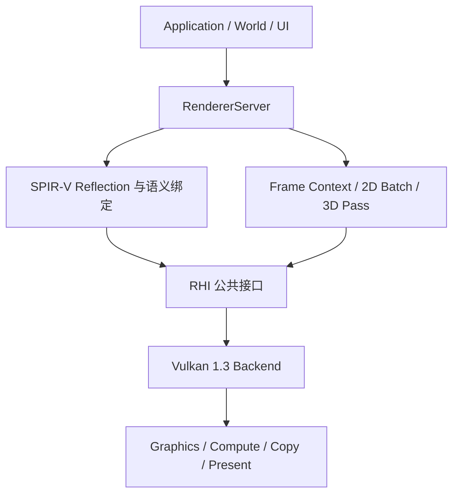
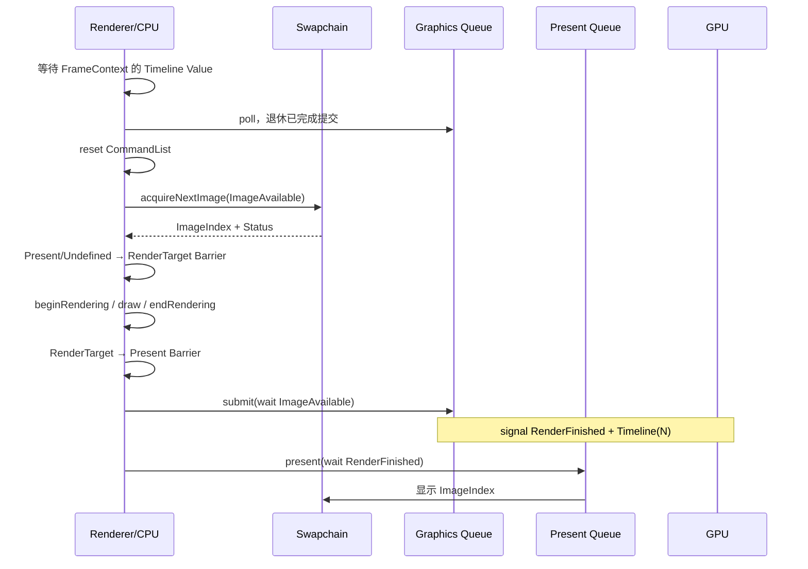
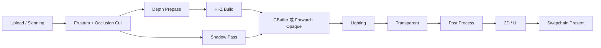

# SeedEngine 现代 RHI 与 2D/3D 渲染全流程

> **状态基线（2026-09-11）**：本文是 RHI 行为, 已实现能力和剩余限制的唯一状态源. 
> 代码中的 `DeviceFeatures` 是运行时最终裁决；标记为“契约”的接口可能有安全默认实现，
> 只有对应能力为 true 时才可依赖 Vulkan 路径. 

## 0. WSI 恢复边界

- `OutOfDate` / `Suboptimal` 只重建交换链. 常规 resize 不执行 device-wide `waitIdle`. 
    旧 generation 销毁前仅等待 present queue：graphics timeline 能证明渲染完成，但不能证明
    presentation engine 已消费 binary present semaphore，因此该窄化的 queue-idle 是保守安全边界. 
- `SurfaceLost` 必须先调用 `IRHI::recoverSurface()`，再调用 `RSwapchain::recoverSurface()`. 
    Surface 使用 generation 共享所有权，旧 surface 会保留到所有旧 swapchain generation 释放. 
- `DeviceLost` 是终态. 后端标记 `RDevice::getStatus()`，拒绝继续提交或创建资源；应用必须重建
    RHI, Device 以及全部 device-dependent resources，不提供伪透明恢复. 
- Device 与 Swapchain 没有“当前全局交换链”可变指针，交换链对象可独立持有 generation. 
    但当前 `IRHI::initialize(window)` 应用入口只创建一个 SDL surface；真正多窗口需要把 surface
    创建/销毁提升为按 window 的公共工厂 API，不能只在后端内部扩展. 

## 1. 目标与边界

本文定义 SeedEngine 从窗口到 GPU 呈现的统一路径，以及 2D, 3D Renderer 应当如何建立在 RHI 之上. 

核心原则：

1. **RHI 只表达后端无关的 GPU 语义**，不负责材质, 场景, 精灵或资源反射. 
2. **Renderer 负责策略**：Shader 反射, 语义绑定, 批处理, 可见性, Pass 排序, 上传和逐帧资源. 
3. **Vulkan 后端负责机制**：原生对象, 队列提交, Synchronization2, Dynamic Rendering, Swapchain 和能力查询. 
4. Pipeline, Layout, 资源描述创建后不可变；变化通过创建新对象表达. 
5. GPU 生命周期由 Timeline/Fence 完成值决定，不能由“CPU 已经录制结束”推断. 
6. 不支持的功能必须通过 `DeviceFeatures` 明确报告，并在调用时给出错误，不能静默降级. 

当前分层：



依赖只能向下. Renderer 可以知道 `RBuffer`，但不能知道 `VkBuffer`；RHI 不能知道 Sprite, Material 或 Camera. 

---

## 2. 已实现的现代 RHI 能力

### 2.1 资源与绑定

- 不可变 Buffer, Image, ImageView, Sampler 描述. 
- Graphics/Compute Pipeline 与 Pipeline Layout. 
- Vertex/Pixel/Compute/Geometry/Hull/Domain/Task/Mesh Shader 阶段. 
- PipelineManager 异步创建, 缓存与 canonical key. 
- BindGroupLayout, BindGroup 和 Vulkan Descriptor Pool Arena. 
- SPIR-V 反射, 跨 Shader 接口合并, 按名称/语义自动绑定. 

### 2.2 CommandList

- 严格状态：`Initial → Recording → Executable → Pending → Completed`. 
- Primary 与 Secondary CommandList；支持 Dynamic Rendering inheritance，作用域内执行要求
    `RenderingInfo::SecondaryCommandBuffers=true` 且继承签名与活动附件严格兼容. 
- Dynamic Rendering. 
- Pipeline, BindGroup, Push Constant, Viewport, Scissor 和基础动态状态. 
- Vertex/Index Buffer 绑定. 
- Direct, Indexed, Mesh, Indirect Draw 与 Direct/Indirect Dispatch. 
- Buffer/Image Copy, Buffer↔Image Copy, Image Blit, Buffer Fill. 
- Global, Buffer, Image Barrier，基于 Vulkan Synchronization2. 
- Timestamp/Occlusion Query 接口. 
- Debug Label 接口；仅在 Debug Utils 可用时启用. 

### 2.3 队列与同步

- `RQueue`：Submit, Present, Poll, WaitIdle. 
- Binary Semaphore：Acquire 和 Present 边界. 
- Timeline Semaphore：帧完成, 跨队列依赖和资源退休. 
- Fence：CPU 等待外部提交或工具流程. 
- 每次 Submit 在后端保留 CommandList 及其资源，直到内部完成 Fence 被 `poll()` 观察为完成；
    调用方 Fence 是额外通知对象，不承担后端引用退休职责. 
- Graphics, Compute, Copy 选择独立队列族；不存在专用队列时回退到兼容队列族. 
- Present 始终使用设备选择的 Present Queue，因此允许 Graphics/Present 队列族不同. 

### 2.4 Swapchain

- 描述式创建，不再通过创建后 Setter 修改属性. 
- Acquire 返回 `Success/Suboptimal/OutOfDate/SurfaceLost/NotReady`. 
- Present 返回对应状态，Renderer 决定何时重建. 
- Swapchain Image 包装成外部所有权 `RImage`，并提供普通 `RImageView`. 
- Resize/Recreate 保留旧 Swapchain 给 Vulkan 驱动复用. 
- 0×0 尺寸表示最小化：释放交换链，跳过渲染；恢复尺寸后重建. 
- Surface 只由共享 Vulkan Context 持有，不再由 Swapchain 重复创建和销毁. 

### 2.5 生命周期根

`VulkanContext` 是引用计数的后端所有权根，持有：

- Instance；
- PhysicalDevice；
- LogicalDevice；
- Surface；
- Graphics/Compute/Copy/Present Queue Family. 

销毁顺序固定为：等待使用者释放 → Device → Surface → Instance. 这样外部持有 `RDevice`, Queue, Semaphore 或 Swapchain 时，不会引用已经销毁的 `VulkanRHI` 成员. 

---

## 3. 一帧的完整执行路径

Renderer 当前使用 3 个 Frame Context. 每个 Frame Context 包含：

- 一个可复用 Primary CommandList；
- 一个 Acquire Binary Semaphore；
- 上一次提交的 Timeline Value. 

每个 Swapchain Image 单独持有一个 Render-Finished Binary Semaphore. 它不能仅按 Frame Context 复用：Graphics Timeline 完成不代表 Present Engine 已经消费该信号；重新 Acquire 到同一图像才是安全复用该 Present Semaphore 的边界. 



伪代码：

```cpp
wait(frame.completionValue);
graphicsQueue.poll();
frame.commands.reset();

auto acquired = swapchain.acquireNextImage(frame.imageAvailable);
if (acquired.outOfDate()) {
    recreateSwapchain();
    return;
}

commands.begin();
commands.imageBarriers(UndefinedOrPresent, RenderTarget);
commands.beginRendering(...);
record2DAnd3D(commands);
commands.endRendering();
commands.imageBarriers(RenderTarget, Present);
commands.end();

graphicsQueue.submit(
    commands,
    wait = frame.imageAvailable,
    signal = { image.renderFinished, timeline(N) });
graphicsQueue.present(swapchain, acquired.imageIndex, image.renderFinished);
```

实际代码通过 `RendererServer::renderFrame()` 执行这条路径. 无回调时清屏；回调在颜色渲染作用域内执行，可绑定 Pipeline, BindGroup, Vertex/Index Buffer 并绘制. 

---

## 4. 资源状态与 Barrier 规则

### 4.1 三类 Barrier

| 类型 | 用途 |
|---|---|
| `GlobalBarrier` | 全局内存可见性，不改变 Image Layout |
| `BufferBarrier` | Buffer 子范围同步，可执行队列所有权转移 |
| `ImageBarrier` | Image Layout, 访问范围, 子资源和队列所有权转移 |

`Size == 0` 表示从 Offset 到 Buffer 末尾. Image Barrier 必须明确 mip/layer 范围，不能默认把单个 mip 的操作扩大到所有子资源. 

### 4.2 常见状态流

上传静态 Vertex Buffer：

```text
CPU writes staging
staging: Common → CopySrc
vertex:  Undefined/Common → CopyDst
copyBuffer
vertex:  CopyDst → VertexBuffer
```

上传 Texture：

```text
CPU writes staging
texture: Undefined → CopyDst
copyBufferToImage(mip 0)
各 mip: CopyDst ↔ CopySrc
blitImage 生成 mip
all mips: CopySrc/CopyDst → PixelShaderResource
```

交换链：

```text
第一次使用: Undefined → RenderTarget → Present
以后使用:   Present   → RenderTarget → Present
```

Compute 写, Graphics 读：

```text
compute queue: UnorderedAccess 写
signal timeline N
如队列族不同：release ownership

graphics queue wait timeline N
如队列族不同：acquire ownership
NonPixelShaderResource / PixelShaderResource 读
```

不要使用 `waitIdle()` 作为正常逐帧同步. 它只适合 shutdown, 破坏性 swapchain recreate, 诊断和简单工具. 

---

## 5. 上传, 读回与资源退休

### 5.1 上传系统应位于 Renderer

RHI 提供 map, copy 和 barrier 原语；Renderer 应实现持久映射 Upload Ring：

1. 每个 Frame Context 拥有一个大块 HostVisible staging Buffer. 
2. 线性分配并按设备对齐要求对齐. 
3. CPU 写入后，仅非 HostCoherent 内存调用 flush. 
4. 在 Graphics 或 Copy CommandList 中批量录制 Copy. 
5. 用 Timeline Value 标记 Ring 区间何时可复用. 
6. 大资源超出 Ring 时使用专用 staging allocation，完成后延迟销毁. 

初始版本可在 Graphics Queue 上传，以避免 Exclusive Buffer 的跨队列所有权成本. 专用 Copy Queue 版本必须补齐 release/acquire ownership，并与 Graphics Queue 用 Timeline 连接. 

### 5.2 Readback

1. 目标 Buffer/Image 转为 CopySrc. 
2. Copy 到 HostVisible + HostCached Readback Buffer. 
3. Signal Timeline Value. 
4. CPU 等待该 Value. 
5. 非 HostCoherent 内存先 invalidate，再读取映射地址. 

### 5.3 延迟销毁

RHI 已实现统一延迟释放；Renderer 在资源最后一次提交后调用：

```text
device.deferRelease(resource, completionTimeline, completionValue)
device.collectDeferredReleases()
```

不变量是：仅当同设备 Timeline 的 `completedValue >= completionValue` 时才释放最后一个
`shared_ptr`. 队列保存 `{sequence, semaphore, value, resource}`；收集过程在锁内筛选并移出，
在锁外按入队顺序析构，避免析构回调重入锁. `waitIdle()` 已证明所有提交完成，因此直接清空；
DeviceLost 时不能再等待 Timeline，也进入终止清理. 若 `deferRelease()` 返回 false，调用方必须
继续持有对象，不能立即假定安全. Pipeline 热重载, 旧 BindGroup, 尺寸相关 Attachment 和临时
staging 都应走此路径. 

---

## 6. 现代 2D 渲染流程

2D 不应为每个 Sprite 单独创建 Buffer, BindGroup 或提交一次 Draw. 推荐流程：

### 6.1 CPU 收集

1. World/UI 提交 Sprite, Glyph, Shape 和 Line. 
2. 将可见对象转换为统一 `SpriteInstance`. 
3. 生成 Sort Key：
   - Render Layer；
   - Blend Mode；
   - Material/Pipeline；
   - Texture/Bindless Index；
   - Depth 或稳定提交序号. 
4. Stable Sort，保证透明对象顺序可预测. 

### 6.2 批处理

- 静态 Unit Quad 作为共享 Vertex/Index Buffer. 
- 每个 Sprite 只写 Instance 数据：Transform, UV, Color, TextureIndex. 
- 相同 Pipeline/Material/Scissor 合并为一个 Batch. 
- 优先使用 Descriptor Indexing/Bindless Texture；不支持时按 BindGroup 分批. 
- 文本先通过 Font Atlas 转换成 Glyph Sprite，再进入同一批处理器. 
- UI Clip 使用 Scissor；复杂 Mask 使用 Stencil 或中间 Render Target. 

### 6.3 GPU Pass

```text
Upload Sprite Instances
→ Optional GPU culling/sort
→ 2D Opaque
→ 2D Alpha
→ UI/Text
→ Debug Overlay
```

透明 2D 默认采用预乘 Alpha：

```text
SrcColor = One
DstColor = OneMinusSrcAlpha
```

这样可减少纹理边缘色泄漏，并让离屏合成更稳定. 

---

## 7. 现代 3D 渲染流程

完整 3D Frame 建议由 RenderGraph 编排以下 Pass. 并非每个项目都必须启用全部 Pass，但资源和同步边界应保持一致. 



### 7.1 Prepare

- 更新 Camera, View/Projection, Lighting 和 Frame Constants. 
- 上传发生变化的 Material, Instance 和 Bone 数据. 
- CPU Frustum Culling；大量对象时由 Compute 生成 Indirect Draw Buffer. 
- PipelineManager 预取本帧可能使用的 PSO，禁止在热路径同步编译. 

### 7.2 Shadow

- 每个 Directional Cascade, Spot Light 或 Point Light Face 创建 Shadow View. 
- Depth-only Pipeline；按材质 Alpha-Test 状态分批. 
- Shadow Atlas 由 RenderGraph 跟踪写后读转换. 

### 7.3 Depth Prepass / Hi-Z

- Depth Prepass 写主深度. 
- Compute 将 Depth 降采样到 Hi-Z Pyramid. 
- 下一帧或后续阶段使用 Hi-Z 做遮挡剔除. 

### 7.4 Opaque

两种主路径：

- Deferred：写 GBuffer，然后 Lighting Pass. 
- Forward+：Compute 构建 Cluster Light List，Opaque Pass 直接着色. 

Opaque 按 Pipeline → Material → Mesh 排序，最大化 Pipeline/BindGroup 命中率. 

### 7.5 Transparent

- 通常按 Camera Depth 从后向前排序. 
- 不写 Depth，只读 Depth. 
- 粒子可以使用 GPU 生成的 Indirect Draw. 
- 需要大规模透明时可扩展 Weighted Blended OIT. 

### 7.6 Post Process 与 Present

典型顺序：

```text
HDR Scene Color
→ SSAO/SSR 合成
→ Bloom
→ TAA/FXAA
→ Exposure + Tone Mapping
→ Color Grading
→ Upscale
→ 2D/UI
→ Swapchain
```

Post Process 中间纹理由 RenderGraph transient allocator 复用，不能作为永久 Texture 逐 Pass 重建. 

---

## 8. Pipeline, BindGroup 与 Draw Packet

### 8.1 Pipeline Key

Graphics Pipeline Key 至少包含：

- Shader 与入口；
- Vertex Layout；
- Primitive Topology；
- Rasterizer, Depth/Stencil, Blend, Multisample；
- Dynamic State 集合；
- Dynamic Rendering 的 Color/Depth/Stencil Format 与 ViewMask；
- Pipeline Layout ABI. 

不要把 Render Target 对象地址放入 Key；只放兼容性签名. 

### 8.2 BindGroup 频率

推荐组约定：

| Group | 频率 | 内容 |
|---|---|---|
| 0 | Frame/View | Camera, Light, Shadow, 全局纹理 |
| 1 | Material | Material Constants, Texture/Sampler |
| 2 | Object/Instance | Transform, Skinning, Instance Buffer |
| 3 | Pass | SSAO, Bloom, 临时输入输出 |

SPIR-V Reflection 负责验证 Shader ABI；语义解析器负责把 Renderer 资源填入 BindGroup. 反射结果应缓存，不应逐帧执行. 

### 8.3 Draw Packet

Renderer 应把场景对象转换成不可变 Draw Packet：

```text
Pipeline
PipelineLayout
BindGroups + DynamicOffsets
VertexBindings
IndexBinding
PushConstants
Draw/DrawIndexed/Indirect 参数
SortKey
```

Render Pass 只消费 Draw Packet，不访问 ECS 或资源加载器，从而允许并行收集和未来 RenderThread. 

---

## 9. RenderGraph 扩展设计

当前 `RendererServer::renderFrame()` 已稳定完整的 Swapchain 帧边界. 多 Pass 2D/3D 下一层应引入 RenderGraph，而不是继续把所有逻辑堆入 RendererServer. 

建议最小接口：

- `importImage/importBuffer`：Swapchain, 历史缓存, 外部资源. 
- `createTransientImage/createTransientBuffer`：声明临时资源. 
- `addGraphicsPass/addComputePass/addCopyPass`. 
- Pass 声明 Read/Write 状态和子资源范围. 
- Compile 阶段执行拓扑排序, 生命周期分析, Barrier 合并和 Queue 调度. 
- Execute 阶段分配 transient 资源并录制 CommandList. 

RenderGraph 必须生成现有 `GlobalBarrier/BufferBarrier/ImageBarrier`，不能绕过 RHI 直接生成 Vulkan Barrier. 

### 不应一开始实现的优化

- 自动 Pass 合并；
- 复杂 Alias Heap；
- 多线程 Secondary Recording；
- 跨队列自动调度；
- Ray Tracing Pass. 

先保证单队列拓扑, 状态跟踪和 transient 生命周期正确，再逐项能力门控. 

---

## 10. Resize, 设备丢失与异常路径

### Resize

1. 收到窗口尺寸事件，只记录目标尺寸. 
2. 0×0：停止 Acquire 和 Present. 
3. 非零：等待破坏性旧资源安全点. 
4. Recreate Swapchain. 
5. 重建与尺寸相关的 Depth, HDR, GBuffer, Hi-Z 和 Post Process 资源. 
6. 清空 Image 初始化状态. 
7. RenderGraph 使用新尺寸重新编译. 

### OutOfDate/Suboptimal

- Acquire OutOfDate：不录制, 不提交，立即请求重建. 
- Acquire Suboptimal：信号量已经被 signal，必须正常提交并消费，再在 Present 后重建. 
- Present OutOfDate/Suboptimal：提交已经发生，等待安全点后重建. 

### SurfaceLost

Surface Lost 不能只重建 Swapchain；应回到平台层重新创建 Surface. 公共状态已保留该分支，当前 Renderer 返回 `SurfaceLost` 交给上层决定窗口重建或退出. 

### DeviceLost

所有 Vulkan 异常最终应转换成 Renderer 可识别的 DeviceLost 状态. 恢复策略通常是：停止提交 → 收集诊断 → 销毁整个 RHI Device → 重创 GPU 资源；不能假设单独重建 Swapchain 足够. 

---

## 11. 能力门控

当前基线强制要求：

- Vulkan 1.3；
- Dynamic Rendering；
- Synchronization2；
- Timeline Semaphore；
- Swapchain. 

可选并严格门控：

- Mesh/Task Shader；
- Descriptor Indexing；
- Multiview；
- Secondary CommandList 与 Dynamic Rendering inheritance；
- Timestamp/Occlusion Query；
- Debug Label；
- Extended Dynamic State 1/2, Vertex Input Dynamic State；EDS3 仅报告后端完整启用的子能力集合，
    当前公共动态状态没有 EDS3 专属 Setter；
- Pipeline Statistics；
- Buffer Device Address, Acceleration Structure, Ray Query, Ray Tracing Pipeline；四者分别门控. 

这些可选路径都已查询并按实际启用结果报告. Pipeline Statistics 还受构建开关影响；
`RayQuery` 目前表示 Shader/Descriptor 能力，不存在独立的 RHI inline-ray-query 命令. 

---

## 12. 验证清单

每次 RHI 变更至少执行：

1. 全量 CMake/Ninja Build. 
2. CTest 公共契约测试. 
3. Launcher 真实设备烟雾测试. 
4. Vulkan Validation 无 Error. 
5. 至少一次 Acquire → Clear/Draw → Submit → Present. 
6. Resize, 最小化, 恢复和 OutOfDate 路径. 
7. Upload → Copy → Readback 数据一致性. 
8. 连续多帧确认 Binary Semaphore 未被过早复用. 
9. Pipeline/BindGroup 不兼容输入必须明确失败. 
10. Shutdown 时无悬垂 Device/Surface/Instance. 

当前自动测试覆盖无设备公共契约；Launcher 覆盖初始化, 反射 BindGroup 和真实 Swapchain 帧. 
没有把无 GPU 契约测试描述成 GPU 正确性证明. 后续仍需 GPU Runner 覆盖隐藏窗口多帧, Resize, 
Upload/Readback, Indirect, Query, Secondary, HDR 和 RT. 

---

## 13. 推荐落地顺序

1. 稳定当前单线程 Frame Context 与 Swapchain. 
2. 实现 Renderer Upload Ring, Readback Pool，并统一使用已完成的 RHI Deferred Release Queue. 
3. 定义 Draw Packet 与 2D Batch Renderer. 
4. 建立单队列 RenderGraph：Depth/Opaque/Transparent/Post/UI. 
5. 接入场景可见性和 Material 系统. 
6. 增加 GPU Culling 与 Indirect Draw. 
7. 接入 Compute/Copy Queue 及自动 ownership transfer. 
8. 最后再启用 RenderThread, Secondary 并行录制, Ray Tracing. 

这条顺序保证每一步都有可运行的完整帧，不会为了提前引入高级并发而破坏资源生命周期和同步正确性. 

---

## 14. Renderer → RHI → Vulkan 的具体调用边界

| 层 | 已实现入口 | 负责内容 | 明确不负责 |
|---|---|---|---|
| Renderer | `RendererServer::renderFrame()`, `ShaderBinding` | 帧上下文, 2D/3D 排序与批次, 反射语义, 交换链状态策略 | 原生句柄, 内存类型, Vulkan feature chain |
| RHI 公共层 | `RDevice`, `RCommandList`, `RQueue`, `RSwapchain` | 不可变描述, 能力门控, 资源归属, 显式同步与状态 | ECS, 材质策略, 自动 RenderGraph |
| Vulkan | `VulkanDevice`, `VulkanCommandList`, `VulkanQueue`, `VulkanSwapchain` | Vulkan 对象, 参数验证, 命令映射, WSI 结果归一化 | 静默降级, 猜测下一次资源用途 |

完整帧不是“Draw 然后 Present”，而是：

1. **Acquire**：`RSwapchain::acquireNextImage()` 仅在 `Success/Suboptimal` 返回有效索引；
2. **Record**：`RCommandList::begin()` → `barriers()` → `beginRendering()` → bind/draw →
     `endRendering()` → Present barrier → `end()`；
3. **Submit**：`RQueue::submit()` 等待 image-available binary，信号每图像 render-finished binary
     和单调 Timeline 值；
4. **Synchronize**：下一次复用 Frame Context 前等待其 Timeline 值，`RQueue::poll()` 退休完成提交；
5. **Present**：`RQueue::present()` 在 Present Queue 等待 render-finished；
6. **Retire**：`RDevice::collectDeferredReleases()` 只释放已被 Timeline 证明安全的对象. 

资源引用有两层保护：提交对象保留 CommandList 与记录资源直到内部 Fence 完成；跨对象替换/热重载
再用 `deferRelease()` 绑定调用方选择的 Timeline 完成点. 两者不能用 CPU 录制结束替代. 

## 15. 现代内存分配器：已实现算法

`MemoryAllocationDescriptor` 将硬约束与偏好分离：`Requirements`, `RequiredProperties` 必须满足，
`PreferredProperties` 只参与内存类型评分，`EMemoryUsage` 会补充 GPUOnly/CPUToGPU/GPUToCPU/CPUOnly
常用属性. `MemoryRequirements::RequiresDedicatedAllocation`, `PrefersDedicatedAllocation` 和大对象
（至少页面一半）走 dedicated allocation. 

普通分配使用按内存类型及“是否需要 Device Address”隔离的页：DeviceLocal 默认 64 MiB，
HostVisible 默认 16 MiB. 页内算法为：

1. 对每个空闲区间计算 `alignedOffset = alignUp(offset, alignment)`；
2. 排除前缀填充或请求大小不能容纳的区间；
3. 选择尾部浪费最小的候选，即 best-fit；
4. 分配后把对齐前缀与尾部拆回空闲表并按 Offset 排序；
5. 释放时插入区间, 排序，并线性合并所有相邻区间；
6. 空页仅在 `releaseCachedPages()`/设备 idle 安全点回收. 

非 HostCoherent 子分配额外按 `nonCoherentAtomSize` 对齐并保留整原子区间；`flush()`/`invalidate()`
把范围向原子边界扩展. HostVisible 页面在页面生命周期内持久映射，单个 allocation 的
`map()`/`unmap()` 只控制客户端访问状态. 该算法受 **Vulkan Memory Allocator** 文档中的分配器
工程实践启发，但本项目是独立实现，未声称复制 VMA 代码或完整具备 VMA 的预算, 丢失分配, 
虚拟块等功能. 

## 16. BDA, EDS 与 Secondary Dynamic Rendering

### 16.1 Buffer Device Address（已实现，可选）

`DeviceFeatures::BufferDeviceAddress` 来自 Vulkan 1.2/1.3 feature；Buffer 必须声明
`EBufferUsage_t::DeviceAddress`，对应内存分配必须带 `VK_MEMORY_ALLOCATE_DEVICE_ADDRESS_BIT`. 
随后 `RBuffer::getDeviceAddress()` 映射 `vkGetBufferDeviceAddress`. 地址为 0 表示不可用，不能持久化
到磁盘，也不能跨设备/资源生命周期使用. AS build input, scratch 和 SBT 都依赖该能力及各自 Usage. 

### 16.2 Extended Dynamic State（已实现，可选）

- 基础动态状态：Viewport, Scissor, BlendConstants, StencilReference, DepthBias, LineWidth；
- `VK_EXT_extended_dynamic_state`：CullMode, FrontFace, PrimitiveTopology, DepthTestEnable, 
    DepthWriteEnable, DepthCompareOp, StencilTestEnable, StencilOperations；
- 核心动态模板 Mask：StencilCompareMask, StencilWriteMask；
- `VK_EXT_vertex_input_dynamic_state`：完整 VertexInput；
- EDS2/EDS3 feature chain 已查询和启用；当前公共命令集合没有 EDS2/EDS3 专属状态，因而 feature
    为 true 不等于所有扩展命令都可由 RHI 调用. 

Pipeline 创建验证请求位是否受支持，`RCommandList` Setter 成功后设置 initialized bit；Draw 前要求
`Pipeline.DynamicStates & ~InitializedDynamicStates == 0`. 动态 PrimitiveTopology 还必须保持 Vulkan
允许的 topology class. 接口返回 false 的 Setter 表示能力/状态/参数不满足，绝不代表已降级为静态值. 

### 16.3 Secondary（已实现，可选）

创建 Secondary 时用 `CommandListDescriptor::RenderingInheritance` 提供 Color/Depth/Stencil format, 
sample count 和 view mask. Vulkan 映射 `VkCommandBufferInheritanceRenderingInfo`. Primary 开始 Scope 时
设置 `RenderingInfo::SecondaryCommandBuffers=true`，映射
`VK_RENDERING_CONTENTS_SECONDARY_COMMAND_BUFFERS_BIT`；此时 Primary inline draw 被拒绝. 
`executeSecondary()` 检查同设备, 同队列类型, Executable 状态和 `isRenderingCompatible()`，并保留
Secondary 及其资源. 带 Rendering inheritance 的 Secondary 不能在 Scope 外执行，反之亦然. 

## 17. Query 结果布局与时间换算

`QueryPoolDescriptor` 支持 Timestamp, Occlusion 和 PipelineStatistics. 统计 Mask 的结果按 Vulkan
规范定义的 bit 递增顺序排列；每个 Query 的数值数为 Mask 中置位数，其余类型为 1. 

`RQueryPool::getResults(first,count,results,flags)` 的目标布局为：

```text
query 0: value[0..N-1], optional availability
query 1: value[0..N-1], optional availability
...
```

实现内部始终向 `vkGetQueryPoolResults` 请求 availability，因而 bool 返回值精确表示“全部可用”；
未就绪且没有 Partial 时不覆盖值. Timestamp 禁止 Partial. GPU copy 使用
`RCommandList::copyQueryResults()`/`vkCmdCopyQueryPoolResults`，调用方显式给定字宽, Stride 和目标偏移. 

`DeviceLimits::TimestampValidBits` 来自队列族，`TimestampPeriodNanoseconds` 来自
`VkPhysicalDeviceLimits::timestampPeriod`. 调用方先按 valid bits 处理回绕差值，再用
`timestampTicksToNanoseconds(delta, period)`；公式为 $t_{ns}=ticks\times timestampPeriod$. 

## 18. Ray Tracing：已实现流程与边界

能力依赖为 BDA → `VK_KHR_acceleration_structure` → 可选 `VK_KHR_ray_query` / 
`VK_KHR_ray_tracing_pipeline`；分别由 `BufferDeviceAddress`, `AccelerationStructure`, `RayQuery`, 
`RayTracingPipeline` 报告，不能只检查最后一个布尔值. 

### 18.1 AS

1. 几何 Buffer 声明 `AccelerationStructureBuildInput|DeviceAddress`；
2. `RDevice::getAccelerationStructureBuildSizes()` 查询 storage/build/update scratch；
3. 创建 `AccelerationStructureStorage|DeviceAddress` Buffer；
4. `RDevice::createAccelerationStructure()` 在 256-byte 对齐区间建立 BLAS/TLAS 包装；
5. scratch 声明 `Storage|DeviceAddress`，地址满足
     `MinAccelerationStructureScratchOffsetAlignment`；
6. `RCommandList::buildAccelerationStructures()` 记录 Build/Update，并保留 geometry, scratch, src/dst；
7. 上层负责 build 前后 Barrier, BLAS 完成后生成 TLAS instance，以及可选 compaction 流程. 

Triangles, AABBs 只用于 BLAS，Instances 只用于 TLAS. Update 要求 Source, 同类型以及
`AllowUpdate`. 公共 Flags 已建模 compaction，但**压缩大小 Query, Copy/Compact 命令尚未建模**. 

### 18.2 Pipeline 与 SBT

`RayTracingPipelineDescriptor` 独立于 Graphics：Stages 仅接受 RayGeneration/AnyHit/ClosestHit/Miss/
Intersection/Callable；General, TrianglesHitGroup, ProceduralHitGroup 会验证 shader role，至少一个
RayGeneration group，递归深度不超过设备限制. `PipelineManager` 已把 RT 描述纳入语义缓存. 

创建后用 `RDevice::getRayTracingShaderGroupHandles()` 获取紧密排列的 handle. **RHI 没有自动 SBT
Builder**：Renderer 必须依据 `ShaderGroupHandleSize`, `ShaderGroupHandleAlignment`, 
`ShaderBindingTableAlignment`, `MaxShaderGroupStride` 写入带 `ShaderBindingTable|DeviceAddress` Usage 的
Buffer，构造四个 `ShaderBindingTableRegion`. `traceRays()` 检查地址/Stride/Size/dispatch limits 后映射
`vkCmdTraceRaysKHR`. SBT record 内联数据布局由 Renderer/Shader ABI 负责. 

`RayQuery` 当前只允许 Shader stage, AS descriptor 和 feature 使用；没有 CPU 命令式 ray-query API. 
没有 GPU 集成测试时，契约测试不宣称验证 AS 构建结果, Shader 命中或 SBT 执行正确性. 

## 19. WSI, HDR 与恢复分类

所有 Vulkan WSI 返回值在 `vulkan_wsi::mapStatus/mapAcquire/mapPresent` 归一化：

| 类别 | 行为 |
|---|---|
| `NotReady` | 仅 Acquire timeout/not-ready；本帧稍后重试，不提交 |
| `Suboptimal` | 本次图像有效；必须消费 Acquire 信号并完成提交/Present，再计划重建 |
| `OutOfDate` | 重建 Swapchain generation；不重建设备 |
| `SurfaceLost` | `IRHI::recoverSurface(window)` 后 `RSwapchain::recoverSurface(w,h)` |
| `DeviceLost` | 终态；停止创建/提交，重建 RHI, Device 和全部 device-dependent resources |

`RDevice::getSwapchainCapabilities()` 返回尺寸, 格式/色彩空间 pair, PresentMode；Pair 不可拆开任意
组合. `RequireExactFormatAndColorSpace` 禁止 fallback. HDR 当前识别 RGB10A2/RGBA16F 与
HDR10_ST2084/ExtendedSRGBLinear 的受支持 pair；`VK_EXT_hdr_metadata` 可用且处于 HDR 色彩空间时，
`RSwapchain::setHDRMetadata()` 映射 `vkSetHdrMetadataEXT`. 这只设置显示元数据，不执行 tone mapping, 
曝光, 色域映射，也不保证 OS/显示器已经开启 HDR. 

## 20. 实现状态矩阵与剩余限制

| 能力 | 状态 | 仍然诚实存在的限制 |
|---|---|---|
| Queue/Fence/Binary/Timeline, 提交引用退休 | 已实现 | 缺少覆盖多队列竞态的 GPU CI |
| Deferred release | 已实现 | API 由调用方提供正确“最后使用”Timeline 点 |
| 页式 best-fit/coalescing allocator | 已实现 | 无显存 budget/defrag/alias heap；Image 现代分配覆盖仍需持续审计 |
| BDA | 已实现, 能力门控 | 地址生命周期由调用方遵守 |
| EDS/动态 VertexInput | 已实现, 能力门控 | EDS3 仅 feature 报告，无公共专属 Setter；Viewport/Scissor count 仍固定为 1 的 Pipeline 模型 |
| Secondary dynamic rendering inheritance | 已实现 | 无多线程性能/设备矩阵集成测试 |
| Query read/copy/timestamp conversion | 已实现 | 无真实 GPU 数值/回绕集成测试 |
| AS/RT Pipeline/SBT dispatch | 已实现, 能力门控 | 无 SBT Builder, AS compaction/copy/serialization, GPU RT 测试 |
| HDR capability/metadata | 已实现, 能力门控 | 无 tone mapping, 显示器协商 UX, HDR GPU/显示测试 |
| WSI recovery classification | 已实现 | 公共初始化仍是一窗口一 Surface；DeviceLost 不透明恢复 |
| 2D batch, 完整 3D RenderGraph, transient alias | 合同/设计 | 尚未成为完整 Renderer 产品路径 |
| D3D12/Metal/OpenGL 后端 | 占位 | 当前唯一可用后端是 Vulkan 1.3 |
| Legacy `RTexture::createTexture()` | 合同占位 | Vulkan 明确抛出未实现，不应在新代码使用 |

## 21. 权威依据与术语映射

- **Vulkan 1.3 Specification**：Synchronization and Cache Control, Queries, Window System Integration, 
    `vkQueueSubmit2`, `VkDependencyInfo`, `vkAcquireNextImageKHR`, `vkQueuePresentKHR`, 
    `vkGetQueryPoolResults`：<https://registry.khronos.org/vulkan/specs/1.3-extensions/html/vkspec.html>
- **VK_KHR_dynamic_rendering**：`VkRenderingInfo`, `VkPipelineRenderingCreateInfo`, 
    `VkCommandBufferInheritanceRenderingInfo`, `vkCmdBeginRendering`：
    <https://registry.khronos.org/vulkan/specs/latest/man/html/VK_KHR_dynamic_rendering.html>
- **VK_KHR_synchronization2** 与 **VK_KHR_timeline_semaphore**：`vkCmdPipelineBarrier2`, 
    `VkSemaphoreSubmitInfo`, Timeline 单调值：
    <https://registry.khronos.org/vulkan/specs/latest/man/html/VK_KHR_synchronization2.html>, 
    <https://registry.khronos.org/vulkan/specs/latest/man/html/VK_KHR_timeline_semaphore.html>
- **VK_EXT_extended_dynamic_state**, **VK_EXT_extended_dynamic_state2/3**, 
    **VK_EXT_vertex_input_dynamic_state**：对应 feature structure 与 `vkCmdSet*EXT`：
    <https://registry.khronos.org/vulkan/specs/latest/man/html/VK_EXT_extended_dynamic_state.html>
- **VK_KHR_buffer_device_address**：`VkMemoryAllocateFlagsInfo`, `vkGetBufferDeviceAddress`：
    <https://registry.khronos.org/vulkan/specs/latest/man/html/VK_KHR_buffer_device_address.html>
- **VK_KHR_acceleration_structure**, **VK_KHR_ray_tracing_pipeline**, **VK_KHR_ray_query**：
    `VkAccelerationStructureBuildGeometryInfoKHR`, `vkCmdBuildAccelerationStructuresKHR`, 
    `VkRayTracingPipelineCreateInfoKHR`, `vkGetRayTracingShaderGroupHandlesKHR`, `vkCmdTraceRaysKHR`：
    <https://registry.khronos.org/vulkan/specs/latest/man/html/VK_KHR_acceleration_structure.html>, 
    <https://registry.khronos.org/vulkan/specs/latest/man/html/VK_KHR_ray_tracing_pipeline.html>
- **VK_EXT_swapchain_colorspace** 与 **VK_EXT_hdr_metadata**：surface format/color-space pair 和
    `VkHdrMetadataEXT`/`vkSetHdrMetadataEXT`：
    <https://registry.khronos.org/vulkan/specs/latest/man/html/VK_EXT_swapchain_colorspace.html>, 
    <https://registry.khronos.org/vulkan/specs/latest/man/html/VK_EXT_hdr_metadata.html>
- **Khronos Vulkan Guide**：Synchronization, Dynamic Rendering, Ray Tracing 等实践说明：
    <https://docs.vulkan.org/guide/latest/>
- **GPUOpen Vulkan Memory Allocator — Memory allocation**：块分配, 子分配与 dedicated allocation
    的算法背景，仅作为设计灵感来源：<https://gpuopen-librariesandsdks.github.io/VulkanMemoryAllocator/html/memory_mapping.html>. 
