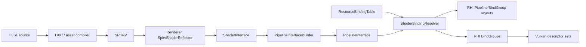

# Modern BindGroup and shader reflection design

## 1. Goals

A modern resource-binding layer must cover nearly every resource visible to HLSL/SPIR-V while preserving a backend-neutral ABI. It must also support two independent workflows:

1. **Manual RHI binding** — low-level systems explicitly create layouts and immutable BindGroups.
2. **Reflection-driven binding** — Renderer reflects shaders, merges stage ABIs, resolves resources by stable semantic names, and creates the same RHI objects automatically.

The implementation deliberately separates these responsibilities:



- **RHI** owns resources, immutable layouts, concrete BindGroups, native descriptor pools/writes, command binding, device feature checks, and resource lifetime retention.
- **Renderer** owns SPIR-V reflection, stage-interface merging, stable resource IDs, semantic resource lookup, automatic BindGroup construction, and layout reuse.
- **SPIRV-Reflect is private to Renderer.** The RHI remains usable without reflection and does not depend on shader source language or asset tooling.

This also establishes the dependency direction requested by the runtime architecture:

```text
UI / Launcher -> Renderer -> RHI -> Vulkan
```

## 2. Concepts and invariants

### 2.1 Layout is ABI; BindGroup is data

`RBindGroupLayout` declares *what* a shader may access:

- binding number;
- descriptor type;
- array maximum;
- shader-stage visibility;
- dynamic-offset, partially-bound, variable-count, and update-after-bind policy.

`RBindGroup` stores *which concrete resources* occupy that ABI. It is immutable after creation. Updating a material therefore creates/reuses another BindGroup instead of mutating a set potentially used by in-flight GPU commands.

`RPipelineLayout` preserves BindGroup set indices, including empty groups, and contains push-constant ranges. Compatibility uses canonical byte keys rather than pointer identity or hash alone.

### 2.2 Supported resource classes

The RHI descriptor model includes:

| RHI type | Typical HLSL declaration | Vulkan mapping |
|---|---|---|
| `UniformBuffer` | `ConstantBuffer<T>` / `cbuffer` | uniform buffer, optionally dynamic |
| `ReadOnlyStorageBuffer` | `StructuredBuffer<T>` | storage buffer |
| `ReadWriteStorageBuffer` | `RWStructuredBuffer<T>` | storage buffer |
| `Sampler` | `SamplerState` | sampler |
| `ComparisonSampler` | `SamplerComparisonState` | sampler with comparison state |
| `SampledTexture` | `Texture2D<T>` | sampled image |
| `StorageTexture` | `RWTexture2D<T>` | storage image |
| `UniformTexelBuffer` | typed `Buffer<T>` | uniform texel buffer |
| `StorageTexelBuffer` | typed `RWBuffer<T>` | storage texel buffer |
| `CombinedImageSampler` | combined source-language resource | combined image sampler |
| `InputAttachment` | subpass input | input attachment |
| `AccelerationStructure` | `RaytracingAccelerationStructure` | acceleration structure |

Acceleration-structure descriptor writes remain reserved for the future ray-tracing backend path. All other listed Vulkan descriptor classes are represented by the public API.

### 2.3 Dynamic offsets are policy, not resource types

A uniform/storage buffer remains the same shader resource whether its base address is static or selected per draw. Therefore dynamic behavior is represented by `EDescriptorBindingFlag_t::DynamicOffset`, not separate descriptor enums.

Dynamic offsets are supplied in Vulkan order:

1. increasing set number;
2. increasing binding number inside each set;
3. increasing array element.

`bindBindGroups()` validates count, device alignment, and final buffer range before recording `vkCmdBindDescriptorSets`.

### 2.4 Bindless and runtime arrays

An unbounded shader array is converted into a finite device layout using `RuntimeArrayMaxCount`. Its last binding receives:

- `VariableArrayCount`;
- optionally `PartiallyBound`;
- optionally `UpdateAfterBind`.

Vulkan capability bits are queried and enabled through Vulkan 1.2 feature structures. Unsupported policy is rejected during layout creation rather than silently degraded. A production bindless heap still needs generation-tagged handles, deferred slot reuse after fences, and frame-safe update policy above this layer.

## 3. Reflection and ABI merge

`SpirvShaderReflector::reflect()` validates the module shape, looks up a specific entry point, verifies its execution stage, and extracts:

- descriptor set and binding;
- resource name and stable FNV-1a ID;
- descriptor type;
- array count/runtime-array status;
- block size where available;
- push-constant ranges.

`PipelineInterfaceBuilder::merge()` combines all stages. Two declarations at the same `(set, binding)` must agree on name, type, array shape, and block layout. Their stage visibility is ORed. Partially overlapping push-constant ranges are rejected; identical ranges merge visibility.

Reflection describes the shader ABI only. It does not decide which texture, buffer, or sampler a frame/material should use.

## 4. Semantic automatic binding

`ResourceBindingTable` maps a stable resource ID and its original name to one or more concrete `BindGroupResource` values. Retaining the original name detects the unlikely case of a 64-bit hash collision.

`ShaderBindingResolver` performs this sequence:

1. Build a canonical key from the merged `PipelineInterface`.
2. Reuse a live `RPipelineLayout`, or create group layouts and a pipeline layout.
3. Find each reflected resource by `(ResourceId, original name, array element)`.
4. Build `BindGroupDescriptor` values in set order.
5. Ask `RDevice` to validate and create native BindGroups.

Pipeline layouts are cached because they are pure ABI objects. Concrete BindGroups are not globally cached: material versions, render-graph transient resources, and frame fences must control their lifetime at a higher level.

## 5. Vulkan implementation

### 5.1 Resource objects

- `VulkanBuffer` validates usage and memory properties, allocates/binds memory, and implements bounded map/flush/invalidate operations.
- `VulkanSampler` converts immutable filtering, addressing, anisotropy, and comparison state.
- `VulkanImage`/`VulkanImageView` expose owning-device identity for cross-device validation.

### 5.2 Descriptor allocator

`VulkanDescriptorAllocator` is a thread-safe shared arena rather than one pool per BindGroup. Each pool page:

- supports individual set reclamation;
- is type-complete so later layouts can safely reuse it;
- has a separate update-after-bind class;
- grows by adding pages when allocation reports exhaustion or fragmentation.

`VulkanBindGroup` allocates one set, validates every element against its normalized layout, creates required texel-buffer views, writes descriptors once, and retains all referenced RHI resources. Constructor failure returns the set to its pool.

### 5.3 Command recording

`VulkanCommandList::bindBindGroups()` validates:

- recording state and graphics/compute bind point;
- backend and device ownership;
- set range;
- exact layout compatibility bytes;
- dynamic offset count/order/alignment/range.

The command list retains both BindGroups and pipeline layout until reset, preventing resources from being destroyed while recorded commands still reference them.

## 6. Comprehensive HLSL example

The following declarations demonstrate conventional frame/material/object groups, writable resources, typed buffers, dynamic object constants, and an optional bindless table. HLSL `spaceN` maps to BindGroup/set `N`; register indices map to binding numbers when compiled with a Vulkan-compatible DXC binding policy.

```hlsl
struct CameraData
{
    float4x4 ViewProjection;
    float3 CameraPosition;
    float Time;
};

struct ObjectData
{
    float4x4 Model;
    float4 Tint;
};

struct Light
{
    float3 Position;
    float Radius;
    float3 Color;
    float Intensity;
};

// Set 0: frame/scene frequency.
ConstantBuffer<CameraData> Camera       : register(b0, space0);
StructuredBuffer<Light>   Lights       : register(t1, space0);
TextureCube<float4>        Environment  : register(t2, space0);
SamplerState               LinearClamp : register(s3, space0);

// Set 1: material frequency.
Texture2D<float4> BaseColorTexture : register(t0, space1);
Texture2D<float4> NormalTexture    : register(t1, space1);
SamplerState      MaterialSampler  : register(s2, space1);

// Set 2: draw frequency. Renderer may mark b0 as DynamicOffset.
ConstantBuffer<ObjectData> Object : register(b0, space2);

// Set 3: compute/storage examples.
RWStructuredBuffer<float4> OutputVertices : register(u0, space3);
RWTexture2D<float4>        OutputImage    : register(u1, space3);
Buffer<float4>             LookupTable   : register(t2, space3);
RWBuffer<uint>             Histogram     : register(u3, space3);

// Set 4: optional descriptor-indexing path. The asset policy supplies a finite maximum.
Texture2D<float4> BindlessTextures[] : register(t0, space4);
SamplerState      BindlessSamplers[] : register(s1, space4);

struct PushConstants
{
    uint MaterialTextureIndex;
    uint MaterialSamplerIndex;
    uint LightCount;
    uint Flags;
};
[[vk::push_constant]] ConstantBuffer<PushConstants> Push;

struct VSInput
{
    float3 Position : POSITION;
    float3 Normal   : NORMAL;
    float2 UV       : TEXCOORD0;
};

struct VSOutput
{
    float4 Position : SV_Position;
    float3 WorldNormal : NORMAL;
    float2 UV : TEXCOORD0;
};

VSOutput VSMain(VSInput input)
{
    VSOutput output;
    float4 world = mul(Object.Model, float4(input.Position, 1.0));
    output.Position = mul(Camera.ViewProjection, world);
    output.WorldNormal = normalize(mul((float3x3)Object.Model, input.Normal));
    output.UV = input.UV;
    return output;
}

float4 PSMain(VSOutput input) : SV_Target0
{
    float4 base = BaseColorTexture.Sample(MaterialSampler, input.UV) * Object.Tint;
    if ((Push.Flags & 1u) != 0u)
    {
        base *= BindlessTextures[Push.MaterialTextureIndex]
            .Sample(BindlessSamplers[Push.MaterialSamplerIndex], input.UV);
    }
    return base;
}

[numthreads(8, 8, 1)]
void CSMain(uint3 id : SV_DispatchThreadID)
{
    float4 value = LookupTable.Load(id.x);
    OutputVertices[id.x] = value;
    OutputImage[id.xy] = value;
    InterlockedAdd(Histogram[id.x & 255u], 1u);
}
```

Expected ABI highlights:

| Set | Binding | Reflected type | Typical lifetime |
|---:|---:|---|---|
| 0 | 0 | uniform buffer | frame |
| 0 | 1 | read-only storage buffer | scene |
| 0 | 2 | sampled texture | scene |
| 0 | 3 | sampler | scene |
| 1 | 0–2 | textures and sampler | material |
| 2 | 0 | uniform buffer + dynamic-offset policy | draw |
| 3 | 0–1 | writable storage resources | compute pass |
| 3 | 2–3 | uniform/storage texel buffers | compute pass |
| 4 | 0–1 | variable descriptor arrays | global bindless heap |

The corresponding application flow is:

```cpp
ShaderInterface vertex = SpirvShaderReflector::reflect(vsSpirv, EShaderStage_t::Vertex, "VSMain");
ShaderInterface pixel  = SpirvShaderReflector::reflect(psSpirv, EShaderStage_t::Pixel, "PSMain");
std::array stages { vertex, pixel };
PipelineInterface interface = PipelineInterfaceBuilder::merge(stages);

ResourceBindingTable resources;
resources.set("Camera", BufferBinding { cameraBuffer, 0, sizeof(CameraData) });
resources.set("Lights", BufferBinding { lightBuffer, 0, 0 });
resources.set("BaseColorTexture", TextureBinding { baseColorView });
resources.set("MaterialSampler", SamplerBinding { materialSampler });
resources.set("Object", BufferBinding { objectRingBuffer, 0, sizeof(ObjectData) });

ShaderBindingResolver resolver(device);
ResolvedPipelineBindings bindings = resolver.resolve(interface, resources);
commandList.bindBindGroups(
    EPipelineType::Graphics,
    bindings.PipelineLayout,
    0,
    bindings.BindGroups,
    std::array<uint32_t, 1> { objectDynamicOffset });
```

The example is intentionally split into ABI reflection and semantic resource assignment. C++ never needs hard-coded set/binding numbers in material code; only the shader-visible semantic names must agree.

## 7. Validation and current boundaries

The Launcher smoke test executes the full implemented path on a real Vulkan device:

1. initialize Renderer and RHI;
2. reflect the repository SPIR-V/HLSL fixture;
3. merge its pipeline interface;
4. create matching buffers, image view, and sampler;
5. populate `ResourceBindingTable` by reflected names;
6. resolve layouts and BindGroups;
7. record a graphics descriptor-set bind;
8. destroy all resources before RHI shutdown.

Current intentional boundaries:

- Reflection consumes SPIR-V; HLSL compilation remains an asset/compiler responsibility.
- Acceleration-structure writes await the ray-tracing RHI resource implementation.
- Layout cache is implemented; material/render-graph BindGroup cache policy belongs above the resolver.
- Bindless slot generations and deferred reuse are renderer asset-system work, not descriptor-layout work.
