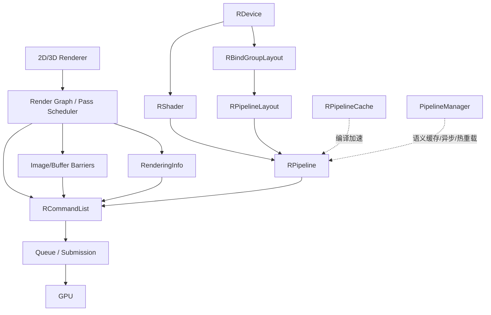
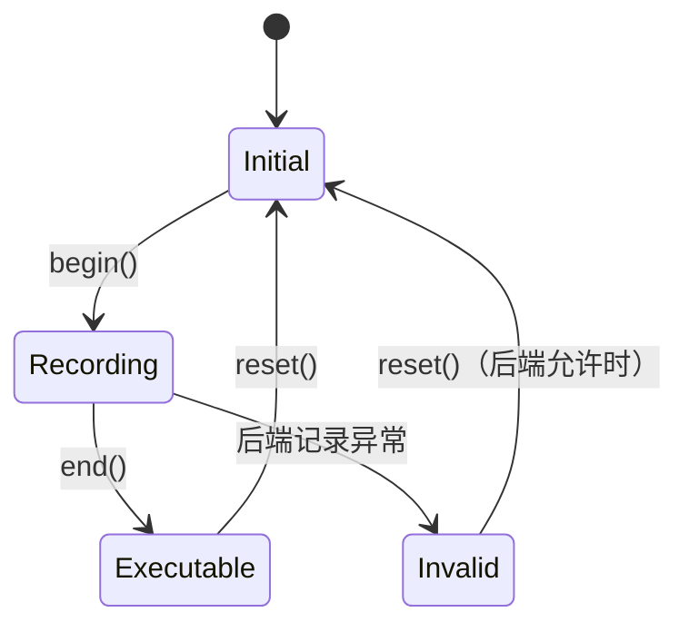
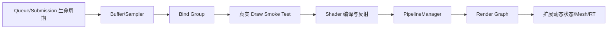

# RHI Pipeline, CommandList 与 Dynamic Rendering 契约

> 本文只说明 Pipeline/CommandList 的局部契约. 完整帧流程, 实现状态, 能力门控和剩余限制以
> [现代 RHI 与 2D/3D 渲染全流程](modern_rhi_rendering_flow_zh.md) 为唯一状态源，避免维护重复清单. 

## 1. 三个独立概念

| 概念 | 公共表示 | 语义 |
|---|---|---|
| Rendering Scope | `RenderingInfo`, `beginRendering()`/`endRendering()` | 本次实际附件, Load/Store/Clear/Resolve 和区域 |
| Pipeline Compatibility | `RenderingSignature` | Color/Depth/Stencil format, sample count, view mask |
| Logical Pass | Renderer/未来 RenderGraph | 资源读写, 排序, 裁剪, Barrier 和队列调度 |

公共 RHI 不暴露持久 `RRenderPass`/Framebuffer. Vulkan 使用 Dynamic Rendering；Scope 不隐式
生成 Barrier，资源状态始终由 Renderer/RenderGraph 明确传给 `RCommandList::barriers()`. 

## 2. Pipeline 对象与缓存

`RShader`, `RBindGroupLayout`, `RPipelineLayout`, `RPipeline` 创建后不可变并绑定一个 `RDevice`. 
Graphics, Compute, Ray Tracing 使用各自描述符. Graphics Pipeline 与活动 Scope 在
`beginRendering()`, `bindPipeline()` 和 Draw 前检查 `RenderingSignature`；Load/Store, 具体 View, 
RenderArea 和 Resolve 目标不进入兼容键. 

两层缓存职责不同：

- `RPipelineCache` 是驱动二进制缓存；同一缓存上的 create/merge/serialize 由后端外部同步；
- `PipelineManager` 是完整语义键, 并发去重和异步创建缓存，已覆盖 Graphics/Compute/Ray Tracing. 

哈希只用于定位，完整规范化键才证明相等. 动态状态**声明集合**进入键；已声明为动态的字段值
不进入键. DebugName, 对象地址, 实际附件和异步等待策略不进入键. 

## 3. CommandList 契约

状态主线为 `Initial → Recording → Executable → Pending → Completed`，完成后才可安全 reset. 
Draw 只能在 Graphics Rendering Scope 内；Dispatch, copy, build AS 等遵循各自 Scope/Queue 限制. 
Queue submission 会保留 CommandList 及记录资源，直到内部完成 Fence 被 `poll()` 退休. 

动态状态已经包含基础 Vulkan 状态, `VK_EXT_extended_dynamic_state` 对应状态, Stencil mask 和
`VK_EXT_vertex_input_dynamic_state`. Pipeline 请求的每一位必须有能力支持，并在 Draw 前通过 Setter
初始化；否则显式失败. Viewport/Scissor 的当前 Pipeline 模型仍固定 count 为 1. 

Secondary 已支持 Dynamic Rendering inheritance：创建时填写
`CommandListDescriptor::RenderingInheritance`，Primary Scope 设置
`RenderingInfo::SecondaryCommandBuffers=true`，`executeSecondary()` 验证同设备, 队列, 状态和附件签名. 
声明 secondary contents 的 Primary Scope 禁止 inline Draw. 

## 4. 已实现高级路径

- BindGroup/Descriptor arena, Push Constant, Vertex/Index, direct/indirect/mesh draw, copy/blit/fill；
- Global/Buffer/Image Synchronization2 barrier 与可选队列所有权转换；
- Timestamp/Occlusion/PipelineStatistics query, CPU readback, GPU result copy, 时间换算；
- Buffer Device Address；
- BLAS/TLAS build/update, Ray Tracing Pipeline, shader-group handle 和 `traceRays()`；
- PipelineManager 的 RT key/异步去重；
- Debug label 和 capability-gated failure. 

详细的 BDA/AS/SBT 步骤, Query 布局, 扩展名称及真实限制见主文档. 

## 5. 仍未完成

- 完整 2D batching, 3D RenderGraph, 自动多队列调度和 transient alias heap；
- 自动 SBT Builder, AS compaction/copy/serialization；
- EDS3 专属公共 Setter；
- Driver cache 持久文件兼容头/损坏恢复, PipelineManager LRU/失败退避/热重载代际；
- 覆盖 Secondary, Query, HDR, RT 和设备丢失的 GPU CI；
- D3D12/Metal/OpenGL 可用后端. 

契约测试只检查无设备语义，不冒充 GPU 执行测试. Vulkan Launcher 是当前真实设备 smoke path. # RHI CommandList, Dynamic Rendering 与 Pipeline 设计

## 1. 文档目的

本文统一记录 SeedEngine 对 CommandList, RenderPass/Dynamic Rendering 和 Pipeline 的设计结论, 当前 Vulkan 实现, 使用约束以及后续路线. 

核心目标如下：

- 面向 Vulkan 1.3, D3D12 和 Metal 等显式图形 API，而不是复刻旧式 OpenGL 状态机. 
- 同时支持全帧/增量 2D, 常规 3D 和由 Render Graph 调度的复杂多 Pass 渲染. 
- 将“执行一次渲染”“Pipeline 兼容性”和“Pass 调度”拆成三个独立概念. 
- 使 Shader, Layout 和 Pipeline 不可变, 可缓存, 可异步创建并支持热重载. 
- 在 RHI 边界明确设备归属, 线程安全, 资源生命周期和错误语义. 

当前后端基线是 Vulkan 1.3，强制要求 Dynamic Rendering 与 Synchronization2. Vulkan RenderPass/Framebuffer 不再作为公共 RHI 对象暴露. 

---

## 2. 总体分层



三种容易混淆的概念必须分开：

| 概念 | 作用 | 当前表示 |
|---|---|---|
| Rendering Scope | 一次实际附件绑定和 Draw 范围 | `beginRendering()` / `endRendering()` + `RenderingInfo` |
| Pipeline Compatibility | Pipeline 可与哪些附件格式组合使用 | `RenderingSignature` |
| Logical Pass | 上层任务, 读写依赖, 调度与裁剪 | 未来 Render Graph Pass |

RHI 不负责推断场景依赖. Render Graph 负责从逻辑 Pass 编译出 Barrier, Rendering Scope 和具体命令；CommandList 只验证并记录这些结果. 

---

## 3. 为什么不保留公共 RRenderPass

### 3.1 旧式 RenderPass 的问题

传统 Vulkan RenderPass 同时承载附件格式, Load/Store, Subpass 和依赖关系，容易导致：

- Pipeline 与具体 RenderPass 对象耦合；
- Framebuffer/RenderPass 组合数量膨胀；
- 2D 增量更新需要制造大量仅参数不同的对象；
- Render Graph 已经掌握依赖，却还要翻译回后端专用 Subpass 模型；
- D3D12, Metal 等后端难以获得自然, 对称的抽象. 

### 3.2 当前结论

公共 RHI 不提供持久 `RRenderPass`，而采用命令级 Dynamic Rendering：

1. 上层准备 `RenderingInfo`；
2. 在进入 Rendering Scope 前显式发出资源 Barrier；
3. 调用 `beginRendering()`；
4. 设置动态状态, 绑定 Pipeline/资源并 Draw；
5. 调用 `endRendering()`；
6. 根据后续用途继续发出 Barrier. 

Vulkan 后端映射为 `vkCmdBeginRendering` / `vkCmdEndRendering`. 未来 D3D12 后端可映射为 Render Target 绑定，Metal 后端可临时创建对应 Render Pass Descriptor. 抽象描述的是语义，不要求各后端拥有同名对象. 

### 3.3 Rendering Scope 不负责同步

`beginRendering()` 不自动转换图像状态，`endRendering()` 也不自动切换到 Present 或 Shader Read. 原因是只有上层调度器知道资源接下来如何使用. 

错误做法是把隐式 Barrier 混进 Rendering Scope，这会：

- 隐藏真实依赖；
- 阻碍 Pass 合并和异步队列调度；
- 产生过度同步；
- 无法准确表达跨队列 Ownership Transfer. 

当前 `imageBarriers()` 使用 Synchronization2，并要求在 Rendering Scope 外调用. 后续还需增加 Buffer Barrier, Memory Barrier 和跨队列所有权转移. 

---

## 4. RenderingInfo 与 RenderingSignature

### 4.1 RenderingInfo：一次渲染实例

`RenderingInfo` 包含：

- Render Area；
- 实际 Color `RImageView` 列表；
- 可选 Depth/Stencil `RImageView`；
- 每个 Aspect 的 Load/Store；
- Clear Value；
- MSAA Resolve View 与 Resolve Mode；
- Layer Count 和 View Mask. 

它引用具体附件，因此只属于一次命令记录，不进入 Pipeline 缓存键. 

Load/Store 语义：

- `Clear`：Scope 开始时清除附件；
- `Load`：保留已有内容，调用方必须保证内容已初始化且状态正确；
- `DontCare`：旧内容无需保留；
- `Store`：Scope 结束后结果仍需使用；
- Store `DontCare`：结果无需保留. 

Resolve 是该 Rendering Scope 的附件操作，但 Resolve 目标格式, Samples 和 Aspect 必须合法. Resolve 目标本身不改变 Pipeline 兼容签名. 

### 4.2 RenderingSignature：Graphics Pipeline 兼容性

`RenderingSignature` 仅包含：

- 有效 Color Attachment 数量及各槽位格式；
- Depth 格式；
- Stencil 格式；
- Sample Count；
- View Mask. 

下列字段不影响 Pipeline 兼容性：

- Load/Store/Clear；
- 实际 `RImage` / `RImageView`；
- Render Area；
- Resolve 目标；
- 图像当前资源状态. 

未使用的颜色槽必须规范化为 `EFormat::Undefined`. Pipeline 创建时通过 `VkPipelineRenderingCreateInfo` 写入签名. 

### 4.3 兼容性检查时机

CommandList 在三个位置检查 Graphics Pipeline 与活动签名：

1. 已绑定 Pipeline 时调用 `beginRendering()`；
2. 已处于 Rendering Scope 时调用 `bindPipeline()`；
3. `draw()` / `drawIndexed()` 前再次检查. 

因此“先绑定 Pipeline”和“先开始 Rendering”都成立，Draw 前仍有最后防线. 

---

## 5. CommandList 设计

### 5.1 职责

`RCommandList` 是命令记录器，负责：

- 维护 Recording 状态机；
- 记录显式 Barrier；
- 开始/结束 Rendering Scope；
- 绑定 Graphics/Compute Pipeline；
- 设置动态状态和 Push Constant；
- 记录 Draw, DrawIndexed 和 Dispatch；
- 校验队列类型, Scope, 设备归属和 Pipeline 兼容性；
- 在记录期间保留被引用对象. 

它不负责：

- 自动构建 Render Graph；
- 自动推导资源依赖；
- 编译 Shader/Pipeline；
- 提交 Queue；
- 等待 GPU；
- 管理跨帧资源生命周期. 

### 5.2 状态机



约束：

- `begin()` 只能从 Initial 开始；
- `end()` 时不能仍处于 Rendering Scope；
- Recording 中不能 `reset()`；
- Draw 必须位于 Rendering Scope 内；
- Dispatch 必须位于 Rendering Scope 外；
- Compute Pipeline 不能在 Rendering Scope 内绑定；
- Graphics 命令必须由 Graphics Queue 类型的 CommandList 记录. 

### 5.3 推荐记录顺序

```text
begin
  imageBarriers(... -> RenderTarget/DepthWrite)
  beginRendering(RenderingInfo)
    bindPipeline(GraphicsPipeline)
    setViewports(...)
    setScissors(...)
    pushConstants(...)
    draw / drawIndexed
  endRendering
  imageBarriers(RenderTarget -> ShaderResource/Present)
end
submit
```

也允许先绑定 Graphics Pipeline 再进入 Rendering Scope，兼容性会在 Scope 开始时验证. 

### 5.4 动态状态

#### 5.4.1 定义和目的

Dynamic State 是在 Native Graphics Pipeline 创建时声明为“由命令提供”的状态. 它把原本固化在 Pipeline 内的值移到 CommandList 记录阶段，从而允许多个 Draw 共享同一个 Pipeline. 

例如 Viewport 为静态状态时，改变窗口尺寸或相机 Viewport 可能需要创建新 Pipeline；Viewport 为动态状态时，只需要记录新的 `setViewports()`. 

动态状态主要解决两个问题：

1. **减少 Pipeline 组合爆炸**：高频变化状态不再为每种取值生成独立 Pipeline；
2. **提高命令记录灵活性**：同一 Pipeline 可用于不同 Viewport, Scissor, Stencil Reference 等 Draw. 

假设 Shader, 附件格式, Blend, Depth 和 Rasterizer 都有多个组合，静态 Pipeline 数量近似为：

$$
N_{pipeline}=N_{shader}\times N_{format}\times N_{blend}\times N_{depth}\times N_{raster}\times N_{viewport}\times\cdots
$$

将高变化频率且后端支持良好的字段动态化，可以移除相应乘数. 但动态状态不是越多越好：它可能需要扩展能力, 增加 Command Buffer 大小, 增加 Draw 前验证和状态排序成本，也可能削弱驱动提前优化的空间. 

#### 5.4.2 三类数据必须分开

Dynamic State 设计中需要区分三种信息：

| 信息 | 示例 | 存储位置 | 是否参与 Pipeline Key |
|---|---|---|---|
| 动态状态声明集合 | Viewport, Scissor 是动态的 | `GraphicsPipelineDescriptor::DynamicStates`, `RPipeline` | 是 |
| 动态状态当前值 | 当前 Scissor 为某个矩形 | CommandList/Native Command Buffer | 否 |
| 对应静态值 | 静态 Cull Mode 为 Back | Graphics Pipeline Descriptor | 仅该状态未动态化时参与 |

动态状态的**声明集合**决定 Native Pipeline 的创建方式，因此必须进入 Pipeline Key. 动态状态的**运行时值**属于命令流，不能进入 Pipeline Key. 

“动态状态不参与缓存键”的准确含义应是：某字段被声明为动态后，该字段的静态取值不参与语义键；不是指 `DynamicStates` 集合本身可以忽略. 

#### 5.4.3 Pipeline 与 CommandList 的契约

Dynamic State 是 Pipeline 契约，不是可选提示：

- Pipeline 创建时声明哪些状态由命令提供；
- CommandList 在 Draw 前必须已经写入这些状态；
- 如果 Pipeline 未声明某状态为动态，则对应 CommandList Setter 不能改变该 Pipeline 的静态值；
- 请求后端未启用的动态状态时，Pipeline 创建必须失败，不能静默退化为静态状态；
- 绑定新 Pipeline 不会自动生成缺失状态，也不应偷偷采用引擎默认值. 

当前 CommandList 使用 `InitializedDynamicStates` 记录本次 Recording 中已经设置过的状态. Draw 前计算：

```text
MissingStates = Pipeline.RequiredDynamicStates & ~CommandList.InitializedDynamicStates
```

只要 `MissingStates` 非空，Draw 就失败. 该检查用于防止把 Vulkan 中未定义的动态状态值带入 Draw. 

#### 5.4.4 生命周期和继承规则

当前语义如下：

- `begin()` 开始一次新的记录，但状态集合在 CommandList `reset()` 时清空；
- Setter 可以在绑定 Pipeline 之前调用，Vulkan 允许先设置状态再绑定 Pipeline；
- 绑定另一个 Pipeline 不清空动态状态，已设置值可被后续 Pipeline 复用；
- `beginRendering()` / `endRendering()` 当前不清空动态状态；
- `reset()` 后所有动态状态都视为未初始化，必须重新设置；
- 不同 CommandList 之间不继承任何动态状态；
- Secondary CommandList 的状态继承尚未定义，不应依赖 Primary CommandList 中设置的值. 

“已初始化”只说明 CommandList 中曾记录对应 Setter，不表示该值对任何 Pipeline 都具有业务意义. 例如动态 Depth Bias 已设置，但 Pipeline 的静态 `DepthBiasEnable` 为 false 时，该值不会产生栅格化效果. 

#### 5.4.5 当前枚举与实现状态

公共 `EDynamicState_t` 为跨后端能力集合. 当前状态如下：

| RHI 状态 | 语义 | Vulkan 状态/命令 | 当前状态 |
|---|---|---|---|
| `Viewport` | NDC 到 Framebuffer 的变换范围 | `eViewport` / `vkCmdSetViewport` | 已实现 |
| `Scissor` | Fragment 写入裁剪矩形 | `eScissor` / `vkCmdSetScissor` | 已实现 |
| `BlendConstants` | Constant Color/Alpha Blend Factor 使用的常量 | `eBlendConstants` / `vkCmdSetBlendConstants` | 已实现 |
| `StencilReference` | Front/Back Stencil Reference | `eStencilReference` / `vkCmdSetStencilReference` | 已实现 |
| `DepthBias` | Constant/Clamp/Slope Depth Bias | `eDepthBias` / `vkCmdSetDepthBias` | 已实现 |
| `LineWidth` | 光栅化线宽 | `eLineWidth` / `vkCmdSetLineWidth` | 已实现，宽线受 `WideLines` Feature 限制 |
| `CullMode` | Front/Back/None Cull | Extended Dynamic State | 已建模，后端未启用 |
| `FrontFace` | CW/CCW Front Face | Extended Dynamic State | 已建模，后端未启用 |
| `PrimitiveTopology` | Point/Line/Triangle/Patch Topology | Extended Dynamic State | 已建模，后端未启用 |
| `DepthTestEnable` | 是否执行深度测试 | Extended Dynamic State | 已建模，后端未启用 |
| `DepthWriteEnable` | 是否写入深度 | Extended Dynamic State | 已建模，后端未启用 |
| `DepthCompareOp` | 深度比较函数 | Extended Dynamic State | 已建模，后端未启用 |
| `StencilTestEnable` | 是否执行模板测试 | Extended Dynamic State | 已建模，后端未启用 |
| `StencilOperations` | Front/Back Stencil 操作和比较函数 | Extended Dynamic State | 已建模，后端未启用 |
| `StencilCompareMask` | Stencil Compare Mask | 核心动态状态 | 已建模，尚无 Setter/映射 |
| `StencilWriteMask` | Stencil Write Mask | 核心动态状态 | 已建模，尚无 Setter/映射 |
| `VertexInput` | Binding/Attribute/Stride/Input Rate | `VK_EXT_vertex_input_dynamic_state` | 已建模，后端未启用 |

Vulkan Pipeline 创建会遍历声明集合并转换为 `vk::PipelineDynamicStateCreateInfo`. 当前转换函数只接受已实现的六个状态；其余状态会明确抛出“不支持”错误. 

#### 5.4.6 当前 Setter 语义

##### Viewport

`setViewports()` 验证：

- 数组不能为空；
- 数量不超过 `DeviceLimits::MaxViewports`；
- Width/Height 大于 0；
- 深度范围满足 $0\leq MinDepth\leq MaxDepth\leq1$. 

当前 Vulkan Graphics Pipeline 固定 `viewportCount = 1`，但公共 Setter 接受多个 Viewport. 这是一个已知不一致：在支持 `VK_EXT_extended_dynamic_state` 的 `ViewportWithCount` 之前，当前后端应限制数量恰好为 1；否则 Pipeline 的静态 Count 与命令提供数量可能不匹配. 

后续应在以下两种模型中二选一：

1. 基础模型：只支持一个动态 Viewport/Scissor，并在 Setter 中强制数量为 1；
2. 扩展模型：增加 `ViewportWithCount` / `ScissorWithCount` 能力，Pipeline 不再固定 Count，并验证扩展 Feature. 

##### Scissor

`setScissors()` 验证数组非空, 数量不超过设备限制, Offset 非负且 Width/Height 非零. 它与 Viewport 具有相同的 Count 一致性问题. 

Scissor 是增量 2D, UI Clip, Shadow Atlas 和局部后处理的重要状态. 它只裁剪光栅化输出，不代表资源 Hazard，也不能替代 Render Graph 对脏区域资源依赖的管理. 

##### Blend Constants

`setBlendConstants()` 提供四个浮点值. 只有 Blend Factor 使用 Constant Color/Alpha 时才影响结果. 即使业务上未使用常量，只要 Pipeline 声明了该动态状态，当前通用验证仍要求调用 Setter. 

后续可以选择继续保持“声明即必须初始化”的简单规则，或者由 Pipeline 规范化阶段判断 Blend State 是否实际消费该值并生成精确的 Required Dynamic State Mask. 后一种方式更精确，但实现和跨后端规则更复杂. 

##### Stencil Reference

`setStencilReference()` 分别记录 Front 和 Back Reference. Reference 只在 Stencil Test 有效时参与比较. 当前将 Front/Back 合并成一个 RHI 动态状态位，因此 Setter 必须一次提供两面，避免只初始化一半. 

`StencilCompareMask` 和 `StencilWriteMask` 已存在枚举，但尚无对应 Setter. 后续应增加成对的 Front/Back 参数，并和 `StencilOperations` 的动态化保持一致. 

##### Depth Bias

`setDepthBias()` 提供：

- Constant Factor；
- Clamp；
- Slope Factor. 

它常用于 Shadow Map, Decal 和 Coplanar Geometry. 是否启用 Depth Bias 当前仍由静态 `RasterizerState::DepthBiasEnable` 决定；动态状态只控制数值. 如果未来启用 Extended Dynamic State，应把 Enable 和数值是否分别动态化的语义建模清楚. 

##### Line Width

`setLineWidth()` 要求 Width 大于 0. Width 不等于 1 时要求设备启用 `WideLines`. 宽线在不同 GPU/后端上的支持和精度差异较大，跨平台渲染器不应把它作为通用几何方案；需要稳定粗线外观时优先生成三角形几何. 

#### 5.4.7 与 Pipeline Key 的关系

构建 Key 时遵循：

- `DynamicStates.Value` 始终参与 Key；
- 某状态未动态化时，其静态值参与 Key；
- 某状态动态化时，其静态占位值不参与 Key；
- 与该状态正交的 Enable, Count 或其他字段仍应按真实语义参与 Key. 

示例：

- `DepthBias` 动态化后，Constant/Clamp/Slope 不进入 Key；
- 当前 `DepthBiasEnable` 仍是静态值，因此继续进入 Key；
- `LineWidth` 动态化后，`RasterizerState::LineWidth` 不进入 Key；
- `Viewport` 和 `Scissor` 的实际矩形从不进入 Key；
- `PrimitiveTopology` 动态化后拓扑值不进入 Key，但 Primitive Restart 和 Patch Control Points 是否继续静态，需要按后端规则独立判断. 

不能直接哈希整个 Descriptor 结构体，因为动态字段需要按声明集合选择性排除，而且结构体可能含 Padding, 无效字段或不稳定浮点表示. 

#### 5.4.8 与 Pipeline 切换和排序的关系

动态状态减少 Pipeline 数量，但不会消除状态切换成本. 上层 Renderer 仍应尽量按以下顺序组织 Draw：

1. Rendering Signature / Pass；
2. Pipeline；
3. Bind Group/Material；
4. Vertex/Index Buffer；
5. Dynamic State；
6. Draw. 

CommandList 后续可增加状态缓存，若新值与已记录值相同则跳过冗余 Setter. 但缓存必须注意：

- 浮点值应采用明确的位级或规范化比较；
- Secondary CommandList 边界不能错误继承；
- Debug/Validation 模式仍应保留调用语义；
- 不要跨 Command Buffer 假定 Native 状态有效. 

#### 5.4.9 与 Dynamic Rendering 的关系

Dynamic State 与 Dynamic Rendering 是两个独立概念：

- Dynamic Rendering 移除持久 RenderPass/Framebuffer 依赖，描述本次实际附件；
- Dynamic State 把部分 Graphics Pipeline 状态值移动到 CommandList. 

两者可以独立使用. `RenderingSignature` 仍参与 Pipeline 兼容性，Viewport/Scissor 等动态值不参与附件签名. 

#### 5.4.10 后续实现计划

1. 修复 Viewport/Scissor Count：短期强制单个，或完整启用 WithCount 扩展；
2. 查询并启用 Extended Dynamic State 1/2/3 与 Vertex Input Dynamic State Feature 链；
3. 在 `DeviceFeatures` 中分别报告每类状态能力，而不是只有粗粒度布尔值；
4. 为每个已开放枚举增加对应 CommandList Setter 和 Vulkan 映射；
5. 明确 `PrimitiveTopology` 与 Primitive Restart/Patch Control Points 的动态组合约束；
6. 增加 Front/Back Stencil Compare/Write Mask Setter；
7. 将 Required Dynamic State Mask 与 Declared Dynamic State Mask 分开，按固定功能是否实际消费状态决定 Draw 前要求；
8. 为动态状态值增加 CommandList 去重缓存和统计；
9. 定义 Secondary CommandList 的继承和执行规则；
10. 增加单元测试：缺失状态, Reset 后失效, 跨 Pipeline 复用, 不支持状态, 宽线 Feature, Count 不匹配和缓存键排除规则. 

### 5.5 Push Constant

`pushConstants()` 显式接收 Pipeline Layout, Shader Stage, Offset 和只读字节范围. 记录时检查：

- Layout 属于同一设备和后端；
- Offset/Size 为 4 字节对齐；
- 不超过设备限制；
- 更新范围和 Stage 被 Layout 中某个 Push Constant Range 覆盖. 

### 5.6 线程安全

- 同一个 CommandList 不能被多个线程同时记录；
- 不同 CommandList 可以并行记录；
- 同一 Queue 的提交必须由 Queue 层串行化；
- 不应以一个全局 Mutex 包围所有 `VkDevice` 调用；
- 共享后端对象只在 Vulkan 规范要求外部同步的位置使用细粒度锁. 

### 5.7 生命周期限制

当前 CommandList 在记录期间通过 `shared_ptr` 保留 Pipeline, Layout 和附件. 但这还不能保证 GPU 执行期间安全. 

正确模型是：

1. CommandList 收集被引用对象；
2. Queue Submission 在提交时接管引用；
3. Submission 关联 Fence 或 Timeline 值；
4. GPU 完成后释放引用；
5. Native Object 进入统一 Deferred Deletion Queue，在安全点销毁. 

这一 Submission 生命周期转移尚未实现，是当前最高优先级缺口之一. 

### 5.8 Secondary CommandList

接口已经区分 CommandList Level，但 Vulkan Secondary Command Buffer 的 Dynamic Rendering Inheritance, 并行录制约束和 Execute Commands 尚未完整实现. 在完成前，不应把 Secondary Level 视为可用于生产. 

---

## 6. 2D 与 3D 的使用方式

### 6.1 全帧 2D

- 每帧重画全部内容；
- Color Attachment 使用 Clear + Store；
- UI/精灵批次可共享 Rendering Scope；
- 通过 Pipeline/Bind Group/Scissor 变化切换批次. 

### 6.2 增量 2D

不要依赖交换链图像跨帧保留内容. Present 后内容是否保持以及下一次 Acquire 获得哪张图像都不可靠. 

推荐方案：

1. 使用持久化离屏 Canvas；
2. 脏矩形更新时对 Canvas 使用 Load + Store；
3. 用动态 Scissor 限制重绘区域；
4. 每帧把 Canvas 合成或复制到当前交换链图像；
5. Canvas 的状态转换由上层调度器显式产生. 

### 6.3 复杂 3D

Render Graph Pass 声明资源读写和附件用途，编译阶段负责：

- 拓扑排序和无用 Pass 裁剪；
- 资源生命周期和瞬态资源别名；
- Barrier 与队列同步；
- 生成 `RenderingInfo`；
- 合并可兼容的 Rendering Scope；
- 选择/预热 Pipeline；
- 最终向多个 CommandList 发出命令. 

Pipeline 本身不区分 2D 或 3D. 两者差异来自上层资源持久性, Pass 编排和 Draw 数据组织. 

---

## 7. Pipeline 对象模型

### 7.1 基本原则

`RShader`, `RBindGroupLayout`, `RPipelineLayout`, `RPipeline` 创建后不可变，并绑定创建它们的 `RDevice`. 

不可变对象带来的收益：

- 可安全共享和缓存；
- 可在后台线程创建；
- CommandList 只保存引用，不复制状态；
- 热重载通过替换对象完成，不修改在途对象；
- 更容易建立完整, 稳定的语义键. 

创建描述符必须拥有异步任务所需数据. 当前字符串, 字节码, 数组和 Specialization Constant 都使用 owning 容器，不能在描述符中保存指向临时数据的 `span` 或裸指针. 

### 7.2 Shader

`ShaderDescriptor` 包含 Stage, 已编译字节码, 入口点, 调试名和可选内容哈希. 

Vulkan 当前只接受 SPIR-V：

- 字节数必须非零且为 4 的倍数；
- 检查 SPIR-V Magic Number；
- `ContentHash == 0` 时根据 Stage, 入口点和字节码计算哈希；
- 非零 `ContentHash` 必须代表真实内容，不得使用路径, 时间戳或对象地址. 

源码编译和反射不属于 `RShader` 本体. 后续 Shader Compiler Service 负责 HLSL/GLSL → SPIR-V，并使用 SPIRV-Reflect 产生 Layout 元数据. 

### 7.3 Bind Group Layout 与 Pipeline Layout

`RBindGroupLayout` 描述一个资源集合的 Binding, Descriptor Type, 数组长度和 Shader Visibility. Vulkan 创建时会按 Binding 规范化并拒绝重复项, 零数组和空 Visibility. 

`RPipelineLayout` 由有序 Bind Group Layout 列表和 Push Constant Range 构成. 列表下标就是 Set/Group 序号，因此顺序属于兼容性. Push Constant 必须对齐, 不重叠且处于设备限制内. 

当前只实现 Layout，没有实现 Bind Group 实例, Descriptor Pool/Allocator, 资源写入和 CommandList 绑定. 

### 7.4 Graphics Pipeline

`GraphicsPipelineDescriptor` 包含：

- Vertex/Pixel/Geometry/Hull/Domain/Task/Mesh Shader；
- Specialization Constants；
- Vertex Input 和 Input Assembly；
- Rasterizer, Multisample, Depth/Stencil, Blend；
- `RenderingSignature`；
- Dynamic States；
- 编译策略和可选 `RPipelineCache`. 

传统路径至少需要 Vertex Shader. Hull/Domain 必须成对出现并使用 Patch Topology. Task 只能与 Mesh 一起使用，Mesh 路径必须与传统 Vertex Input 路径互斥. 

Vulkan 后端将 `VK_EXT_mesh_shader` 作为可选扩展查询：扩展和 `meshShader` Feature 可用时启用 Mesh 路径，`taskShader` 独立报告. Mesh Pipeline 省略传统 Vertex Input, Input Assembly 和 Tessellation CreateInfo，并通过 `drawMeshTasks()` 记录命令；普通 `draw()` / `drawIndexed()` 与 Mesh Pipeline 不能混用. Geometry, Tessellation, Wireframe, Wide Line, Depth Clamp, Depth Bounds, Sample Shading, Alpha To One 和 Independent Blend 仍依据实际启用的设备 Feature 验证. 

Vulkan Shader Stage 临时数据采用显式两阶段模型：

1. `StageStorage::collect()` 只收集并拥有 Shader, Specialization Map 和原始字节，不创建任何非 owning 指针；
2. 最终 Stage 容器停止扩容后统一调用 `finalize()`，再绑定 `pName`, `pMapEntries`, `pData` 和 `pSpecializationInfo`；
3. `getCreateInfo()` 拒绝读取未 finalize 的 Stage. 

因此新增 Stage 不再依赖脆弱的 `reserve(5)` 或移动后的手工指针修复. 

### 7.5 Compute 与未来类型

Compute 使用独立 `ComputePipelineDescriptor`，只包含 Layout, Compute Shader, Specialization Constants 和编译选项. 它不携带 Graphics 固定功能字段，从而保持类型语义和缓存键清晰. 

`EPipelineType::RayTracing` 目前只保留类型空间. 未来需要独立描述：

- Ray Generation/Miss/Hit/Callable Shader Group；
- Shader Binding Table 布局与记录；
- 最大递归深度；
- Acceleration Structure Binding；
- 对应的 Trace 命令. 

不能把 Ray Tracing 字段塞进 Graphics Pipeline 描述符. 

---

## 8. Pipeline Key, 缓存与编译

### 8.1 两层缓存

1. `RPipelineCache`：后端/驱动缓存. Vulkan 对应 `VkPipelineCache`，可 Merge 和 Serialize. 
2. `PipelineManager`：引擎语义缓存，当前负责完整 Key, 并发去重, 有界异步编译, 异常传播, 清理代际和统计；失败缓存, 热重载和预热属于后续功能. 

`RPipelineCache` 不是 Pipeline 对象缓存，也不能替代 `PipelineManager`. 

### 8.2 语义键

Pipeline 完整键至少包含：

- Shader 内容哈希, Stage, 入口点和规范化 Specialization Constants；
- Pipeline Layout 的完整兼容描述；
- 所有非动态固定功能状态；
- `RenderingSignature`；
- 后端功能路径, Key Schema 和引擎版本. 

不应进入语义键：

- 对象指针；
- Debug Name；
- 超时；
- 异步策略；
- 实际附件对象；
- Load/Store/Clear；
- 已声明为动态的状态值. 

动态状态“集合”必须进入 Key，因为它决定 Native Pipeline 的创建方式；动态状态“值”不进入 Key. 

哈希只用于定位 Bucket，不是兼容性的最终证明. 命中后必须比较规范化完整键以消除碰撞. 当前 Vulkan `getCacheKey()` 提供稳定的 64 位加速哈希，但上层完整键比较尚未实现. 

### 8.3 Descriptor 规范化

生成 Key 前应：

- Bindings 按 Binding 排序；
- Vertex Attributes 按 Location 排序；
- Specialization Constants 按 ID 排序；
- 未使用附件槽归零为 Undefined；
- 清除无效/未使用字段；
- 对浮点字段定义稳定的位级规则，明确 `-0` 和 NaN 行为；
- 不直接哈希带 Padding 的 C++ 结构体内存. 

### 8.4 驱动缓存并发

Vulkan 规范要求对同一 `VkPipelineCache` 外部同步. 当前实现对以下操作使用 Cache 级细粒度锁：

- 使用 Cache 创建 Pipeline；
- Merge；
- Serialize. 

Merge 会按稳定顺序锁定全部源/目标 Cache，避免死锁. 不能用全局 Device Mutex 替代该设计. 

### 8.5 磁盘缓存

`serialize()` 返回的驱动字节只可在兼容环境复用. 磁盘文件必须额外保存并验证：

- Magic 与 Schema Version；
- RHI Backend；
- Engine/Build Version；
- Vendor ID, Device ID；
- Driver Version；
- Vulkan Pipeline Cache UUID；
- 数据长度与校验和. 

验证失败应丢弃缓存并重新创建，不能把不兼容字节直接传给驱动. 

### 8.6 异步编译

RHI 的创建函数是同步原语. `AllowAsync` 只是提交给上层 `PipelineManager` 的策略意图. 

推荐流程：

1. 规范化 owning 描述符并生成完整 Key；
2. 在 Concurrent Map 中查询 Key；
3. 已有 Ready 结果则直接返回；
4. 已有 Compiling 任务则共享 Future；
5. 否则登记 Promise 并提交 Worker；
6. Worker 调用同步 RHI 创建；
7. 发布成功对象或分类错误. 

超时表示调用方停止等待，不表示编译失败. 多数驱动编译不能安全强制取消；任务完成后结果仍应进入缓存. 

### 8.7 编译失败

错误至少分为：

- 永久错误：描述符非法, Shader Stage 不匹配, Layout 不兼容；
- 环境错误：Feature/Extension 不支持；
- 瞬时错误：内存压力, 临时驱动错误；
- Device Lost：使整个设备 Generation 失效. 

失败缓存必须绑定 Shader Generation, Device Generation 和 Key Schema. 永久错误可缓存，瞬时错误应退避重试，不能永久污染缓存. 

### 8.8 热重载

推荐流程：

1. 编译新 Shader；
2. 生成新内容哈希和反射；
3. 失效依赖旧 Shader Generation 的 Pipeline Key；
4. 后台创建新 Pipeline；
5. 在安全帧边界原子替换上层 Handle；
6. 旧 Pipeline 随 Submission 完成值进入延迟销毁. 

不可原地修改 `RShader` 或 `RPipeline`，也不能在编译失败时破坏仍可工作的旧对象. 

---

## 9. 多设备, 错误和调试语义

### 9.1 多设备

每个 GPU/Logical Device 必须拥有独立的：

- Shader Module；
- Bind Group/Pipeline Layout；
- Pipeline；
- Driver Pipeline Cache；
- PipelineManager 缓存域；
- Deferred Deletion Queue. 

缓存键可以共享前半部分的逻辑描述，但 Native Object 不能跨设备复用. 所有创建和绑定入口都必须验证设备归属. 

### 9.2 调试名和统计

Public Descriptor 已保存 Debug Name，但 Vulkan Debug Utils Object Name 尚未接入. 后续应给 Shader, Layout, Pipeline, Cache 和 Command Buffer 设置后端调试名. 

统计建议至少包含：

- 请求数, 命中数, Miss 数；
- 同 Key 并发去重数；
- 编译耗时分位数；
- Driver Cache 命中/Compile Required；
- 失败分类；
- 内存占用和对象数量；
- 热重载次数与旧对象回收延迟. 

热路径统计必须通过编译期开关完全移除或采用低开销线程本地计数. 

---

## 10. 编译开关与代码组织

引擎级选项放在 `cmake/EngineBuildRule.cmake`：

- `RHI_ENABLE_VALIDATION`：附加后端诊断；设备归属, 越界和生命周期等安全检查不应因关闭而消失. 
- `RHI_ENABLE_PIPELINE_STATISTICS`：Pipeline 编译/执行统计，默认关闭. 

RHI Target 在模块 CMake 中把这些选项转换为值为 0/1 的私有 Compile Definition. 后端选择, 平台宏和后端依赖也放在 RHI 模块 CMake. GPU Feature 是运行时能力，不应伪装成编译开关. 

项目规范要求公共头使用 `.hpp` 并按模块目录组织. 当前公共入口是单体 `RHI.hpp`；在 API 稳定后应兼容迁移为：

- `rhi/RHICommon.hpp`；
- `rhi/RHIResource.hpp`；
- `rhi/RHIRendering.hpp`；
- `rhi/RHIPipeline.hpp`；
- `rhi/RHICommandList.hpp`；
- `rhi/RHIDevice.hpp`；
- 保留过渡期聚合头，避免一次性破坏全部调用方. 

---

## 11. 当前已经完成

### 11.1 CommandList

- Vulkan Command Pool/Command Buffer RAII；
- begin/end/reset 状态检查；
- Synchronization2 Image Barrier；
- Dynamic Rendering begin/end；
- Viewport, Scissor, Blend Constants, Stencil Reference, Depth Bias, Line Width；
- Push Constant；
- Graphics/Compute Pipeline 绑定；
- Draw, DrawIndexed, Dispatch；
- Rendering/Pipeline 三阶段兼容检查；
- 动态状态初始化检查；
- 后端类型和设备归属检查；
- 记录期间资源引用保留. 

### 11.2 Rendering

- 移除公共持久 RenderPass；
- Color, Depth, Stencil Attachment；
- 独立 Load/Store/Clear；
- MSAA Color/Depth/Stencil Resolve 验证；
- Layer 和 Multiview 描述；
- Attachment 格式, Usage, Samples, 范围和 Render Area 验证；
- `RenderingSignature`. 

### 11.3 Pipeline

- owning Shader Descriptor 和 Vulkan SPIR-V Shader Module；
- Bind Group Layout 与兼容性哈希；
- Pipeline Layout 与 Push Constant Range；
- Graphics/Compute 独立描述符和创建入口；
- Dynamic Rendering Graphics Pipeline；
- 固定功能与 Device Feature 验证；
- Specialization Constants；
- Vulkan Pipeline Cache Merge/Serialize 和细粒度同步；
- 稳定语义加速哈希；
- 不支持功能显式失败. 

---

## 12. 尚未完成以及应该如何做

### P0：提交生命周期与延迟销毁

**缺失内容**：Queue, Submission, Fence/Timeline Semaphore, CommandList 引用转移和 Deferred Deletion Queue. 

**风险**：CommandList `reset()` 后引用会释放，但 GPU 可能仍在执行，可能提前销毁 Pipeline/Image/Layout. 

**实现建议**：

1. 增加 `RQueue`, `RFence`/Timeline 抽象和 `SubmissionToken`；
2. CommandList `end()` 后冻结其引用集合；
3. Queue `submit()` 接管 CommandList 和全部引用；
4. 每次提交分配单调递增完成值；
5. Device 维护按完成值排序的 Deferred Deletion Queue；
6. `poll()`/帧开始时回收已完成对象；
7. Device Lost 时进入统一失效和强制清理流程. 

**验收条件**：连续创建/销毁 Pipeline 和附件并提交多帧，在 Vulkan Validation Layer 下无 Use-After-Free. 

### P0：Buffer, Sampler, Bind Group 与绑定命令

**缺失内容**：`RBuffer`/`RSampler` Vulkan 实现, Bind Group 实例, Descriptor Allocator, 资源写入和 `bindBindGroups()`. 

**实现建议**：

1. 先完成 Buffer/Sampler RAII 与 Device Memory 绑定；
2. 定义 owning `BindGroupDescriptor` 和类型安全的 Buffer/Image/Sampler Binding；
3. 建立按 Frame/Thread 分片的 Descriptor Pool/Allocator；
4. 创建后不可变更新模型，或明确可变 Descriptor 的同步规则；
5. CommandList 绑定时验证 Device, Set Index, Layout Compatibility 和 Dynamic Offset；
6. Submission 接管所有绑定资源引用. 

**验收条件**：能够用 Vertex/Uniform/Texture/Sampler 完成一个真实 Draw，并通过跨设备和错误类型测试. 

### P0：测试体系

**缺失内容**：当前 CTest 没有注册可运行测试. 

**实现建议**：

1. 为 Descriptor 规范化, Layout Hash, Pipeline Key 增加无 GPU 单元测试；
2. 为状态机和错误描述符增加 Mock/Fake Backend 测试；
3. 为 Vulkan 增加可选集成测试，启用 Validation Layer；
4. 覆盖多线程 Cache Merge/Create；
5. 增加 Shader/Pipeline 创建 Smoke Test 和 Render-to-Image 像素校验；
6. 在 CI 中区分无 GPU 测试与 GPU Runner 测试. 

**验收条件**：CTest 至少注册核心无 GPU 测试，错误路径和缓存键稳定性可回归. 

### P1：Shader 编译与反射

**缺失内容**：DXC 尚未接入，SPIRV-Reflect 已在依赖树但未连接 RHI. 

**实现建议**：

1. 建立独立 Shader Compiler Service，不把编译器塞进 `RDevice`；
2. 统一 HLSL 入口, Stage, Define, Include, Optimization 和 Debug 参数；
3. 输出 SPIR-V, 依赖文件列表, 编译日志, 内容哈希和 Reflection；
4. 通过 SPIRV-Reflect 提取 Descriptor, Push Constant, Vertex Input；
5. 合并多 Stage Reflection，检测 Binding 类型/数组/可见性冲突；
6. 自动生成或严格验证 Pipeline Layout；
7. 缓存编译结果并记录 Compiler Version 和 Target Profile. 

**验收条件**：从 HLSL 源码生成可创建 Pipeline 的 SPIR-V，并能检测错误 Layout. 

### P1：PipelineManager

**已实现内容**：

- Graphics/Compute Descriptor 完整字节键和完整键相等比较，哈希仅用于加速查找；
- Layout 暴露规范化兼容键，不再只依赖 64 位兼容哈希；
- 固定数量 `std::jthread` Worker 和有界线程数任务队列；
- 相同 Key 的同步/异步请求共享 `std::shared_future`；
- 驱动编译不持有缓存锁，异步异常通过 Future 传播；
- Manager 共享持有 Device，并提供 `clear()` 代际隔离和命中/未命中/编译中统计. 

**仍缺失内容**：等待超时, 持久失败分类/退避, Shader Generation 热重载, 预热清单和缓存容量/淘汰策略. 

**实现建议**：

1. 增加带 Shader/Device Generation 的 Failed 状态和可配置重试退避；
2. 超时只终止调用方等待，不取消驱动编译；
3. 提供 Warmup Manifest, 容量预算/LRU 和磁盘 Driver Cache；
4. 热重载在安全帧边界替换 Handle；
5. 为重复请求, 失败重试, `clear()` 与析构竞态增加并发测试. 

**验收条件**：多线程重复请求只创建一次，Shader 修改后旧 Pipeline 持续可用并最终安全替换. 

### P1：Render Graph

**缺失内容**：Pass 声明, 依赖编译, 瞬态资源, Barrier 生成和多队列调度. 

**实现建议**：

1. 资源 Handle 与 Pass Builder 声明 Read/Write/Attachment；
2. 编译 DAG, 检测环, 裁剪无输出 Pass；
3. 计算资源首末使用和瞬态别名；
4. 从访问类型生成 Barrier；
5. 生成 `RenderingInfo` 和 `RenderingSignature`；
6. 合并兼容 Scope，避免不必要的 begin/end；
7. 后续加入 Graphics/Compute/Copy 多队列与 Semaphore 依赖. 

**验收条件**：可表达 Deferred Rendering, Shadow, Post Process 和 UI Composite，并自动生成正确同步. 

### P1：Swapchain 完整生命周期

**缺失内容**：Acquire, Present, Resize/Recreate, OutOfDate/Suboptimal, 帧同步和交换链图像的完整 RHI 包装仍不完整. 

**实现建议**：

1. 将交换链图像包装为非 owning `RImage` 和 `RImageView`；
2. 定义 Acquire Result 和 Present Result；
3. 用 Binary Semaphore 处理 Acquire/Present，内部提交可使用 Timeline；
4. Resize 时等待或按 Generation 延迟回收旧 Swapchain；
5. 明确 Present ↔ RenderTarget Barrier；
6. 禁止依赖交换链内容持久性实现增量渲染. 

### P2：扩展动态状态, Mesh Shader 完善与 Ray Tracing

**实现建议**：

- 查询并按需启用 Extended Dynamic State 1/2/3 和 Vertex Input Dynamic State；
- 只在 Feature/Extension 可用时开放对应命令；
- 为已实现的 Mesh/Task 路径补充功能设备集成测试, 极限查询和 Render-to-Image 验证；
- Ray Tracing 使用独立 Pipeline Descriptor, SBT Builder 和 `traceRays()`；
- 所有可选路径进入 Device Feature, Pipeline Key 和测试矩阵. 

### P2：调试, 统计和持久缓存

**实现建议**：

- 接入 `VK_EXT_debug_utils` Object Name 和 Command Label；
- 实现 Pipeline 编译计时, 命中率和错误分类；
- 可用时接入 Pipeline Creation Feedback/Executable Properties；
- 统计热路径由 `RHI_ENABLE_PIPELINE_STATISTICS` 编译移除；
- Driver Cache 文件增加完整兼容头, 校验和, 原子写入和损坏恢复. 

### P2：公共头拆分和 API 收敛

**实现建议**：

1. 在不改语义的前提下拆分 `RHI.hpp`；
2. 提供过渡聚合头；
3. 修正历史拼写和命名时提供迁移周期；
4. 将跨后端公共验证下沉到独立模块，避免 Vulkan 重复实现；
5. 为 Public API 增加统一 Doxygen 注释和线程安全标记. 

---

## 13. 推荐实施顺序



建议优先建立“能安全提交一个真实 Draw”的闭环，而不是立即增加更多 Pipeline 枚举. 具体顺序：

1. Queue/Submission/Fence/延迟销毁；
2. Buffer, Sampler, Bind Group；
3. Swapchain Acquire/Present 与最小三角形/离屏测试；
4. Shader Compiler + Reflection；
5. PipelineManager；
6. Render Graph；
7. Extended Dynamic State, Mesh Shader, Ray Tracing；
8. 完整性能统计, 磁盘预热和工具链. 

这一路线先解决正确性和生命周期，再解决易用性与编译性能，最后扩展高级 GPU 功能. 
